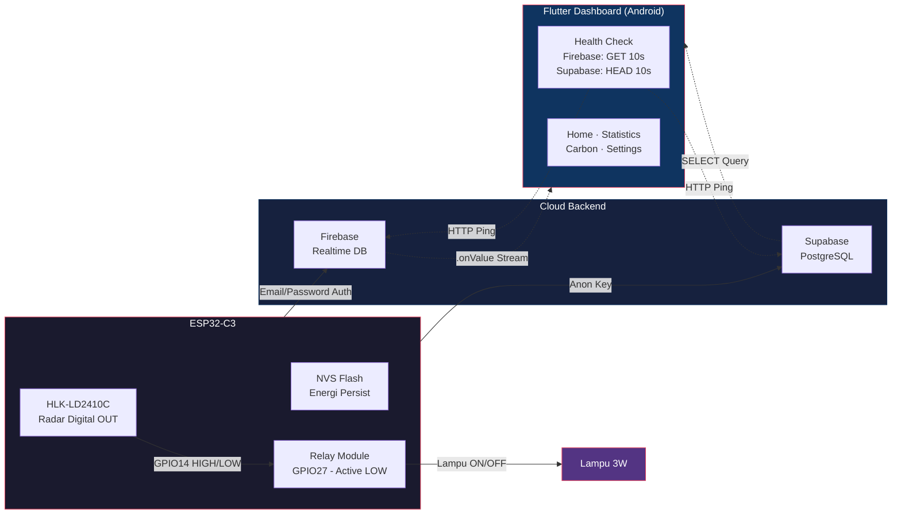

# Smart Room eCO2 — Kicaw

[](https://github.com/terra2n/Kicaw/actions/workflows/flutter_ci.yml)
[](LICENSE)

Prototipe otomatisasi lampu ruangan berbasis **ESP32-C3** dengan sensor radar **HLK-LD2410C** (digital OUT GPIO14) untuk memantau dan mengurangi emisi karbon. Menggunakan arsitektur **dual-backend**: **Firebase Realtime DB** (live status + energi) + **Supabase PostgreSQL** (riwayat sensor, aktivitas, ringkasan harian). **Kontrol lampu 100% otomatis** — tanpa override manual dari aplikasi.

> Referensi: Singh & Dhanekar (2026)

---

## 🏗️ Arsitektur Sistem



---

## 📁 Struktur Repositori

```
├── esp32_iot/                    # Firmware ESP32-C3 (Arduino C++)
│   ├── esp32_iot.ino            # Source code utama (~605 baris)
│   ├── firebase_cmd.h           # Handler command radar via Firebase (legacy)
│   ├── supabase_client.h        # Client HTTP untuk Supabase REST API
│   ├── ld2410_uart.h            # Library protokol UART HLK-LD2410C
│   ├── secrets.h                # Credentials WiFi + Firebase + Supabase (git-ignored)
│   ├── secrets.h.template       # Template credentials
│   ├── wifi_test/               # Test koneksi WiFi
│   └── README.md                # 📘 Dokumentasi firmware
│
├── flutter_dashboard/            # Aplikasi dashboard (Flutter)
│   ├── lib/
│   │   ├── main.dart            # Entry point, init Firebase + Supabase
│   │   ├── app.dart             # Root widget & navigasi bottom bar (4 tab)
│   │   ├── config/              # Konfigurasi (FirebaseConfig, SupabaseConfig)
│   │   │   ├── firebase_config.dart
│   │   │   └── supabase_config.dart
│   │   ├── models/              # Data model (Firebase + Supabase)
│   │   ├── pages/               # Halaman fitur
│   │   │   ├── home/            # Dashboard utama real-time (live status, energi, aktivitas 7 item)
│   │   │   ├── statistics/      # Data historis & grafik
│   │   │   ├── carbon/          # Tracking emisi CO2
│   │   │   └── settings/        # Konfigurasi + status koneksi + radar config
│   │   ├── services/            # Business logic & integrasi database
│   │   │   ├── realtime_service.dart     # Firebase live streams (status, energi, heartbeat)
│   │   │   ├── supabase_service.dart     # Supabase queries (room_status, logs, summaries)
│   │   │   ├── firebase_health_service.dart  # HTTP GET ping ke Firebase RTDB (10s)
│   │   │   ├── supabase_health_service.dart  # HTTP HEAD ping ke Supabase REST (10s)
│   │   │   ├── firestore_service.dart     # Legacy — not actively used
│   │   │   ├── carbon_service.dart        # Perhitungan emisi CO2
│   │   │   └── settings_service.dart      # SharedPreferences
│   │   ├── widgets/             # Shared UI components
│   │   └── theme/               # Material Design 3
│   ├── test/                    # Unit & widget test
│   └── README.md                # 📗 Dokumentasi Flutter
│
├── functions/                    # Cloud Functions (Firebase — legacy, sudah deployed)
│   ├── src/index.ts             # Triggers: onLampChange, onEnergyUpdate, onRadarChange
│   ├── package.json
│   └── tsconfig.json
│
├── supabase/                     # Database Supabase (PostgreSQL)
│   ├── config.toml              # Konfigurasi CLI lokal
│   ├── schema.sql               # Schema utama (4 tabel: room_status, sensor_logs, activity_logs, daily_summaries)
│   ├── seed.sql                 # Seed data awal
│   └── migrations/              # Migrasi database
│
├── .github/workflows/           # CI/CD (Flutter CI)
├── firebase.json                # Konfigurasi Firebase
├── database.rules.json          # Aturan Realtime Database
├── FIREBASE_FUNCTIONS_DEPLOY.md # Panduan deploy Cloud Functions
├── MIGRATION_GUIDE.md           # Panduan migrasi Firebase → Supabase (B. Indonesia)
├── SUPABASE_MIGRATION_GUIDE.md  # Panduan teknis migrasi (English)
├── QUICKSTART_SUPABASE.md       # Panduan setup cepat Supabase (30 menit)
├── LICENSE
└── README.md                    # 📖 Dokumentasi utama (ini)
```

### 📚 Dokumentasi Lengkap

| Dokumen | Isi |
|---------|-----|
| **[ESP32 IoT README](esp32_iot/README.md)** | Wiring hardware, pin konfigurasi, compile/upload, troubleshooting |
| **[Flutter Dashboard README](flutter_dashboard/README.md)** | Fitur aplikasi, arsitektur, service layer, build guide |
| **[SUPABASE_MIGRATION_GUIDE.md](SUPABASE_MIGRATION_GUIDE.md)** | Technical battle plan migrasi (English, detail) |
| **[QUICKSTART_SUPABASE.md](QUICKSTART_SUPABASE.md)** | Setup Supabase dalam 30 menit |

---

## 🛠️ Komponen & Arsitektur

### 🔧 Kebutuhan Hardware

| Komponen | Spesifikasi | Keterangan |
|----------|-------------|------------|
| ESP32 | Dev Board (30/38 pin) | Microcontroller dengan WiFi + Bluetooth |
| Sensor Radar HLK-LD2410C | 24GHz mmWave, UART + digital OUT | Deteksi presence (hingga 9 gate/6m) |
| Relay Module | 1-channel 5V (Active LOW) | Kontrol lampu/LED |
| Lampu LED | 3W (simulasi) | Beban yang dikontrol |
| Power Supply | 5V / 2A | Catu daya ESP32 + relay |

### Pin Wiring

| Pin ESP32 | Terhubung ke |
|-----------|-------------|
| GPIO 14 | OUT (Digital) Sensor Radar |
| GPIO 16 | RX (UART) → TX Sensor Radar |
| GPIO 17 | TX (UART) → RX Sensor Radar |
| GPIO 27 | IN Relay Module (Active LOW) |
| 5V | VCC Sensor Radar & Relay |
| GND | GND Sensor Radar & Relay |

### 🧠 Logika Deteksi

Sistem menggunakan **threshold counter = 1** dengan delay *loop* 50ms:
- **HIGH (presence)** → relay ON → lampu menyala (instan, ~50ms)
- **LOW (no presence)** → relay OFF → lampu mati (instan, ~50ms)
- Threshold = 1 berarti **satu deteksi langsung eksekusi relay** (HLK-LD2410C sudah melakukan filtering internal)
- **Gate 0** = deteksi radius < 75 cm (konfigurasi via **HLKRadarTool** dari Play Store)
- **Tidak ada cloud call di jalur deteksi** — push ke Firebase & Supabase hanya dalam siklus monitoring 5 detik

---

## ☁️ Backend Architecture

Proyek menggunakan arsitektur **dual-backend**:

### Firebase Realtime Database (Live Data)
- **Fungsi**: Menyimpan status real-time (lampu, radar, heartbeat, energi)
- **Streaming**: Flutter menggunakan `.onValue` untuk update instan
- **Path**: `ruangan_01/{status_lampu, status_radar, energi_dihemat_wh, co2_dicegah_mg, last_heartbeat, last_heartbeat_ts, radar_distance_cm, waktu_mulai_mati}`
- **Aturan**: `.read: true` (publik, agar dashboard bisa baca tanpa auth); `.write` via email/password auth
- **Health check**: Flutter melakukan GET `/.json?shallow=true` setiap 10 detik (tidak bergantung heartbeat ESP32)

### Supabase PostgreSQL (Historical & Analytics)

| Tabel | Fungsi | Diakses dari |
|-------|--------|-------------|
| `room_status` | Status live ruangan (single row, UPSERT) | Flutter home, Settings |
| `sensor_logs` | Riwayat sensor per 5 detik | Flutter statistics |
| `daily_summaries` | Agregasi harian (avg, max, min) | Flutter statistics |
| `activity_logs` | Event: motion_detected, lamp_on, lamp_off | Flutter home (7 terbaru) |

Semua tabel: `room_name TEXT NOT NULL DEFAULT 'ruangan_01'` — ESP32 tidak perlu kirim `room_name` karena default sudah sesuai.
**Health check**: Flutter melakukan HEAD `/rest/v1/room_status?select=id&limit=1` dengan `apikey` + `Bearer` header setiap 10 detik.

### Firebase Cloud Functions (TypeScript) — Legacy

Cloud Functions di `functions/` sudah dideploy dan berfungsi sebagai **backup logging** (menulis activity & daily logs ke Firestore). Dashboard Flutter saat ini **tidak bergantung** pada data Firestore — semua data real-time dibaca langsung dari RTDB, data historis dari Supabase.

---

## 📊 Parameter Emisi

Perhitungan emisi CO₂ berdasarkan Singh & Dhanekar (2026):

| Parameter | Nilai | Satuan |
|-----------|-------|--------|
| Daya lampu simulasi (`DAYA_LAMPU_WATT`) | 3.0 | Watt |
| Faktor emisi grid (`FAKTOR_EMISI_GRID`) | 0.85 | kg CO₂/kWh |
| Energi dihemat | `P × t` | Wh |
| CO₂ dicegah | `(Wh / 1000) × 0.85 × 1.000.000` | mg |
| Setara pohon | `CO₂ kg / 21` | pohon/hari |
| Setara mobil | `CO₂ kg / 0.12` | km |
| Setara cas HP | `Wh / 15` | kali cas |

---

## 🚀 Quick Start (30 Menit)

### Prasyarat

| Hardware | Software |
|----------|----------|
| ESP32-C3 Dev Board | Arduino IDE / Arduino CLI |
| HLK-LD2410C Radar Sensor | Flutter SDK ≥3.0 |
| Relay Module 1ch 5V | Akun Firebase (free) |
| Lampu LED 3W + kabel jumper | Akun Supabase (free) |
| USB Cable + Power Supply 5V/2A | Node.js ≥18 (untuk Cloud Functions, opsional)

### 1. Setup Database (5 menit)

#### A. Firebase
```bash
# Buka Firebase Console, buat/aktifkan project "kicaw-smart-room"
# Aktifkan Realtime Database
# Buat user auth email/password (untuk ESP32 write):
#   Authentication → Users → Add User
#   Email: esp32@smartroom.local, Password: Demo123!
# Deploy aturan database:
firebase deploy --only database
```

**Aturan RTDB yang digunakan:**
```json
{
  "ruangan_01": {
    ".read": true,
    ".write": "auth.uid != null"
  }
}
```

#### B. Supabase
```bash
# 1. Buka https://supabase.com → New Project
#    Name: smart-room-eco2 | Region: Singapore
# 2. Buka SQL Editor → paste isi supabase/schema.sql → Run
# 3. Settings → API → catat Project URL & anon public key
```
📖 Panduan detail: [QUICKSTART_SUPABASE.md](QUICKSTART_SUPABASE.md)

### 2. Wired Hardware

```
ESP32 GPIO   →   HLK-LD2410C        Relay
─────────────────────────────────────────
GPIO 14      →   OUT (digital)
GPIO 16 (RX) →   TX (UART)
GPIO 17 (TX) →   RX (UART)
GPIO 27      →                    IN1
5V           →   VCC               VCC
GND          →   GND               GND
```

> **Relay Active LOW**: `HIGH` = mati, `LOW` = nyala

### 3. Setup ESP32-C3 (10 menit)

```bash
# 1. Install library yang diperlukan (via Arduino Library Manager):
#    - FirebaseClient by Mobizt
#    - ArduinoJson by Benoit Blanchon (v7)

# 2. Buat & isi credentials (WiFi + Firebase Auth + Supabase)
cd esp32_iot
cp secrets.h.template secrets.h
nano secrets.h   # isi WiFi, Firebase API Key / DB URL / Auth Email & Password, Supabase URL & Key

# 3. Compile (ESP32-C3)
arduino-cli compile --fqbn esp32:esp32:c3 esp32_iot.ino

# 4. Upload
arduino-cli upload -p /dev/ttyUSB0 --fqbn esp32:esp32:c3 esp32_iot.ino

# 5. Monitor (cek "Supabase connection: SUCCESS")
arduino-cli monitor -p /dev/ttyUSB0 -c baudrate=115200
```

📘 **Panduan lengkap wiring & troubleshooting**: [ESP32 README](esp32_iot/README.md)

### 4. Setup Flutter Dashboard (10 menit)

```bash
cd flutter_dashboard
cp .env.example .env
nano .env        # isi SUPABASE_URL, SUPABASE_ANON_KEY, FIREBASE_DATABASE_URL, FIREBASE_API_KEY
flutter pub get
flutter run
```

📗 **Panduan lengkap fitur & arsitektur**: [Flutter README](flutter_dashboard/README.md)

### 5. Verifikasi (5 menit)

| Cek | Harapan |
|-----|---------|
| Serial Monitor ESP32 | `Supabase connection: SUCCESS`, push data tiap 5 detik, lampu ON/OFF instan |
| Supabase Table Editor | `sensor_logs` dan `activity_logs` terisi data baru |
| Flutter Dashboard → Settings | Firebase & Supabase section menunjukkan "Connected" |
| Flutter Dashboard → Home | Status real-time, energi audit, activity log (7 item terbaru) |
| Gerakan di depan sensor | Lampu menyala seketika (~50ms), dashboard terupdate dalam 5 detik |

---

## 📱 Fitur Dashboard

| Halaman | Fitur | Sumber Data |
|---------|-------|-------------|
| **🏠 Home** | Status ruangan real-time (lampu, radar, heartbeat), indikator motion, energi audit (Wh/CO₂), aktivitas 7 item terbaru | Firebase RTDB (live status) + Supabase (activity_logs) |
| **📊 Statistics** | Grafik 30 hari, total all-time, target bulanan, best day card, emission factor tile | Supabase (daily_summaries) + Firebase RTDB (energi) |
| **🌿 Carbon** | CO₂ tracking, real-world equivalents (pohon, mobil, cas HP) | Firebase RTDB (co2_dicegah_mg) + CarbonService |
| **⚙️ Settings** | Tema, status koneksi Firebase & Supabase (health check 10s), device info, link HLKRadarTool, about section | FirebaseHealthService + SupabaseHealthService + SharedPreferences |

---

## 🧪 CI/CD

Proyek menggunakan **GitHub Actions** untuk:
- **Flutter CI**: Analisis kode (`flutter analyze`) + testing (`flutter test`) otomatis
  - Trigger: Push/PR ke branch `dev` dengan perubahan di `flutter_dashboard/**`
  - Konfigurasi: [`.github/workflows/flutter_ci.yml`](.github/workflows/flutter_ci.yml)

---

## 🔐 Pengelolaan Credentials

### ESP32 (`secrets.h`)
- File sudah di-**gitignore** — tidak akan tercommit
- Isi: WiFi SSID/Password, Firebase API Key/URL, Supabase URL/Anon Key
- Lihat template: [`secrets.h.template`](esp32_iot/secrets.h.template)

### ESP32 (`secrets.h`)
- Isi: `WIFI_SSID`, `WIFI_PASSWORD`, `API_KEY` (Firebase), `DATABASE_URL`, `FIREBASE_AUTH_EMAIL`, `FIREBASE_AUTH_PASSWORD`, `SUPABASE_URL`, `SUPABASE_ANON_KEY`
- ESP32 menggunakan **email/password auth** (bukan anonymous) untuk menulis ke Firebase RTDB

### Flutter (`.env`)
- File `.env` sudah di-**gitignore**
- Isi: `SUPABASE_URL`, `SUPABASE_ANON_KEY`, `FIREBASE_API_KEY`, `FIREBASE_DATABASE_URL`, `FIREBASE_AUTH_EMAIL`, `FIREBASE_AUTH_PASSWORD`
- `FIREBASE_AUTH_EMAIL`/`PASSWORD` digunakan Flutter untuk anonymous sign-in (fallback jika diperlukan)
- Lihat template: [`.env.example`](flutter_dashboard/.env.example)

---


## 🤝 Kontribusi

1. Fork repo ini
2. Buat branch baru: `git checkout -b fitur-anda`
3. Commit perubahan: `git commit -m "feat: menambahkan fitur X"`
4. Push ke branch: `git push origin fitur-anda`
5. Buat Pull Request

---

## 📄 Lisensi

[MIT](LICENSE) © 2026 terra2n
